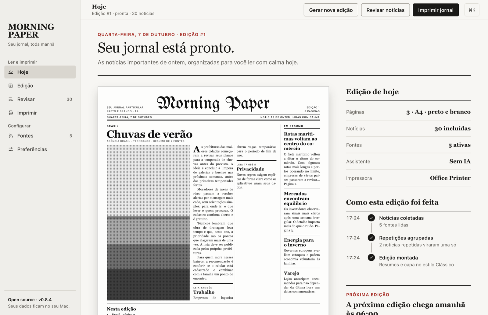
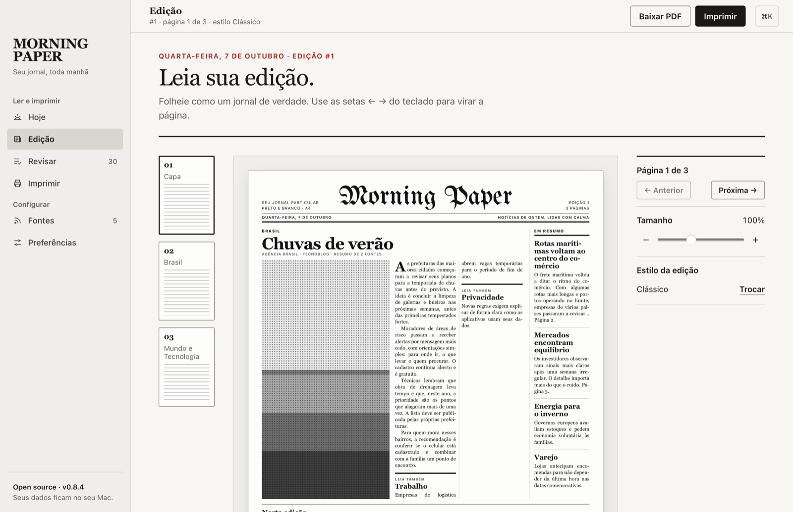

# Morning Paper

[](https://github.com/julianosirtori/morning-paper-app/actions/workflows/ci.yml)
[](LICENSE)

Seu jornal, toda manhã: um app de desktop para macOS que monta uma edição particular de notícias e imprime em preto e branco, no tamanho A4.

**[Baixar para Mac](https://julianosirtori.github.io/morning-paper-app/)** · [Releases](https://github.com/julianosirtori/morning-paper-app/releases)



<details>
<summary>Mais telas</summary>



</details>

## O que ele faz

- Junta as notícias das suas fontes (qualquer site com RSS/Atom) e da sua cidade.
- Escolhe a pauta respeitando o peso de cada assunto e junta a mesma notícia contada por fontes diferentes.
- Opcionalmente resume com o assistente de IA que você já usa no terminal (claude, codex, gemini, ollama, opencode).
- Diagrama capa e páginas internas, gera o PDF e imprime no horário que você escolher.

## Repositório

O repositório é um monorepo com pnpm workspace:

```
apps/
  desktop/               app de macOS (Tauri + React)
  landing/               página de download (Astro), publicada no GitHub Pages
design/                  protótipo, análise de UX e os SVGs originais dos ícones (icons/)
docs/                    documentação para quem desenvolve
.github/                 CI, release, modelos de issue e pull request
```

## Começo rápido

Pré-requisitos: macOS, Node 22.12+, pnpm 10, Rust (`rustup`) e as Command Line Tools do Xcode.

```bash
pnpm install
pnpm app          # app de desktop em modo dev
pnpm check        # typecheck + testes do frontend + testes do Rust + astro check
```

Todos os comandos estão em [docs/development.md](docs/development.md).

## Documentação

- [Desenvolvimento](docs/development.md)
- [Arquitetura](docs/architecture.md)
- [CI e release](docs/release.md)

## Contribuindo

Contribuições são bem-vindas! Leia o [guia de contribuição](CONTRIBUTING.md) e o [código de conduta](CODE_OF_CONDUCT.md). Para relatar falhas de segurança, veja [SECURITY.md](SECURITY.md).

## Licença

[MIT](LICENSE) © Juliano Sirtori
