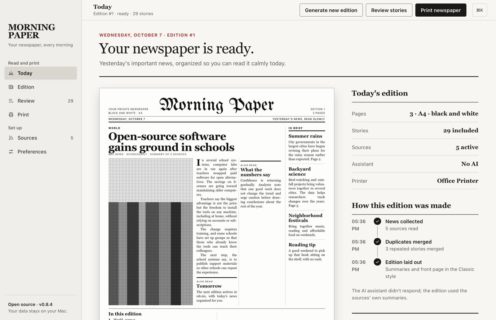
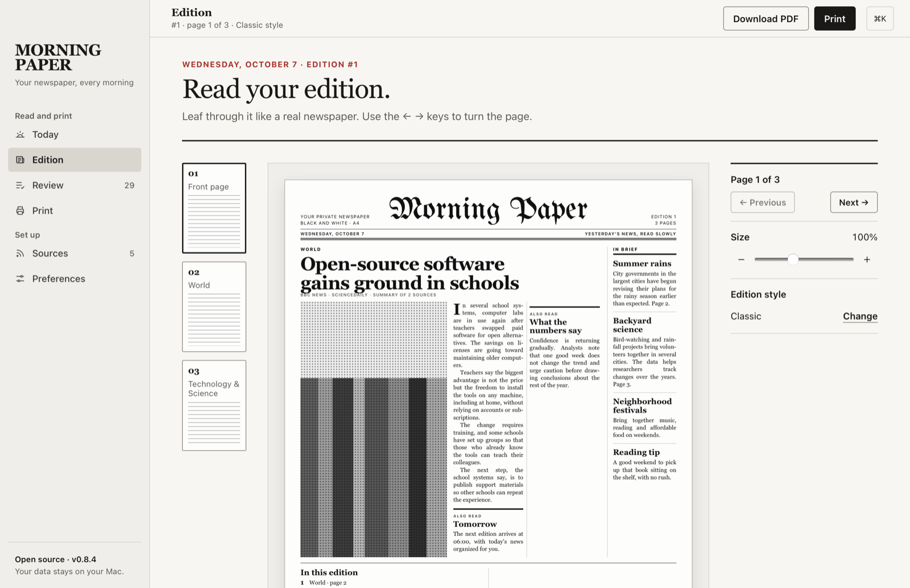

# Morning Paper

**English** · [Português](README.pt-BR.md)

[](https://github.com/julianosirtori/morning-paper-app/actions/workflows/ci.yml)
[](LICENSE)

Your newspaper, every morning: a macOS desktop app that puts together a private edition of the news and prints it in black and white on A4 paper.

**[Download for Mac](https://morning-paper-app.julianosirtori.dev/)** · [Releases](https://github.com/julianosirtori/morning-paper-app/releases)



<details>
<summary>More screens</summary>



</details>

## What it does

- Gathers news from your sources (any site with RSS/Atom) and from your city.
- Picks the stories while respecting how much weight you give each topic, and merges the same story told by different sources.
- Optionally summarizes with the AI assistant you already use in the terminal (claude, codex, gemini, ollama, opencode).
- Lays out the front page and inner pages, generates the PDF and prints it at the time you choose.

## Repository

The repository is a monorepo with a pnpm workspace:

```
apps/
  desktop/               macOS app (Tauri + React)
  landing/               download page (Astro), published on GitHub Pages
design/                  prototype, UX analysis and the original icon SVGs (icons/)
docs/                    developer documentation
.github/                 CI, release, issue and pull request templates
```

## Quick start

Requirements: macOS, Node 22.12+, pnpm 10, Rust (`rustup`) and the Xcode Command Line Tools.

```bash
pnpm install
pnpm app          # desktop app in dev mode
pnpm check        # typecheck + frontend tests + Rust tests + astro check
```

All commands are listed in [docs/development.md](docs/development.md).

## Documentation

The developer docs and the contributing guide are written in Portuguese.

- [Development](docs/development.md)
- [Architecture](docs/architecture.md)
- [CI and release](docs/release.md)

## Contributing

Contributions are welcome! Please read the [contributing guide](CONTRIBUTING.md) and the [code of conduct](CODE_OF_CONDUCT.md). To report a security issue, see [SECURITY.md](SECURITY.md).

## License

[MIT](LICENSE) © Juliano Sirtori
